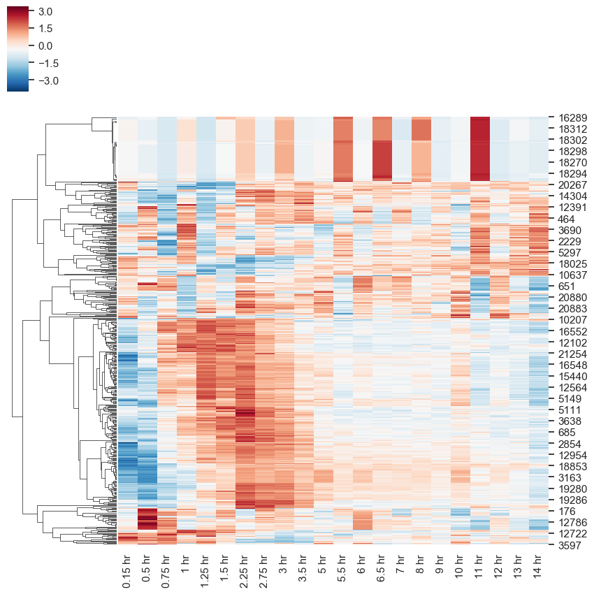

# Time Series Expression Analysis

## Data Downloading and Preprocessing
To download and process data, execute the shell script:
```
bash run.sh
```
This will download the raw data from NCBI GEO database, extract raw data from CEL files then summarize and annotate the files. The final raw counts output can be found in `./data/raw_counts.txt`

## Data
Mouse B cells were treated with Interferon alpha over a time course, the gene expression over time is normalized and visualized in the plot below:



## Cluster


