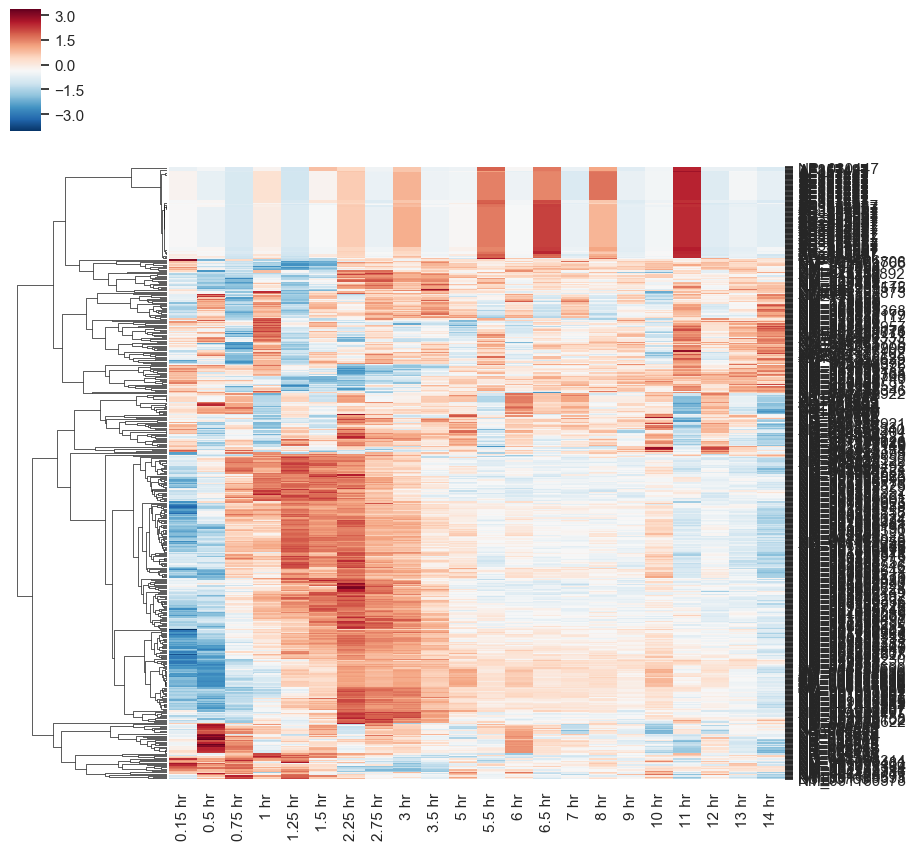
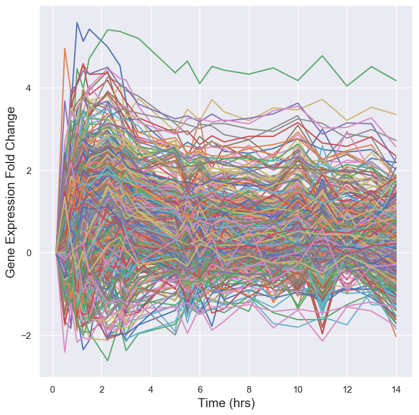

# Time Series Expression Analysis
This is a implementation of analysis that is geared towards analyzing time series expression data. The program will take raw read counts from time series expression data, normalize the data, cluster the genes based on expression patter, extract promoter sequences of each gene cluster and conduct motif enrichment analysis to figure out what underlying transcription factor is potentially regulating such gene expression.

## Usage
### Program requirement
The software uses the python package `clust` for k-means clustering. One can install `clust` by using `pip` or `conda`:
```
pip install clust
```
```
conda install -y clust
```

### Input count data
The data is downloaded from NCBI GEO database (https://www.ncbi.nlm.nih.gov/geo/query/acc.cgi?acc=GSE75306). The data was originally generated for the publication by [Mostafavi, S., et al.](https://doi.org/10.1016/j.cell.2015.12.032). To simplify the process, the raw microarray data is processed and normalized for you. The unprocessed microarray files along with the final raw counts output can be found in `./data/`.

### Input reference data
In order to extract necessary promoter sequences from a list of clustered genes, a series of reference files are needed. This includes:
- mm10.refseq.bed
- mm10.fasta

While the reference bed file is included within `./ref/`, the reference genome file is not due to its large size. So please download the reference genome for mouse:
```
wget -O ./ref/mm10.fa.gz ftp://ftp.ebi.ac.uk/pub/databases/gencode/Gencode_mouse/release_M23/GRCm38.p6.genome.fa.gz
gunzip ./ref/mm10.fa.gz
```

### Data Processing and clustering
To process the raw read count data, a python script is included with default parameter. Once the input data is downloaded. Simply run the python script `main.py`:
```
python main.py
```
Additionally, this program is written in a way to handle any time-series expression data with different time points within each column and genes on each row. To customize specific parameters for your need, you can adjust the following parameters:

Arguments |  Description
--- | ---
-h  | Display help message
-o  | Specify the out directory to store plots <Default: ./out>
-c  | Input read counts file name <Default: ./data/raw_counts.txt>
-k  | Manually conduct K means clustering with specified K. This disables optimization. <Default: None>
-n  | Number of genes to include for generating heatmap and trajectory plots <Default: 50 >
-a  | Enable Analysis of motif enrichment (AME) <Default: False>
-b  | Specify the RefSeq Bedfile to use <Default: ./ref/mm10.refseq.bed>
-g  | Specify which reference genome to use <Default: ./ref/mm10.fa>
-i  | Specify which input genes to use for motif analysis. Default will use each gene cluster from the previous step
-m  | Specify which motif file to use, in MEME format <Default: ./ref/HOCOMOCOv11_core_MOUSE_mono_meme_format.meme>

### Analysis of Motif Enrichment
The previous step will generate a curated promoter sequence file for each gene cluster. To carry out motif enrichment analysis, one can simply upload the promoter sequence files to [AME online server](http://meme-suite.org/tools/ame) and follow the direction on the webpage to generate the results.

Alternatively, this program includes scripts to automatic run AME locally for all gene clusters. To do that, the user needs to install MEME suite locally. The direction for installation can be found [here](http://meme-suite.org/doc/install.html?man_type=web). Once the installation is complete, the user can enable the automated AME analysis by setting '-a' flag to `True`:
```
python main.py -a True
```

# Analysis Results
## Initial Data Processing
Mouse B cells were treated with Interferon alpha over a time course (15 minutes to 14 hours), the gene expression over time is normalized and visualized in the plot below:
#### Heatmap of the top 50 genes that have the greatest variance across time

#### Gene expression trajectory of the top 50 genes that have the greatest variance across time


## Clustering
The K-means clustering utilizes the python package `clust`. It uses the top 5000 genes ordered by variance across time for clustering. Overall, it undergo clustering optimization to find the optimal K that minimizes within-cluster sum of square. And use that optimal K to generate gene clusters.
#### Demonstration of optimization of K-means clustering

#### Clustering Result
Using K-means clustering, the program is able to parse out gene expression patterns and categorized them into groups. For the discussed data set, several gene sets that undergo up-regulation, down-regulation and oscillation were identified:


## Motif Enrichment
Finally, using the promoter sequences parsed out from each gene clusters, the software performs motif enrichment analysis using the AME software package from MEME suite. The screenshot of the analysis result is shown below.
Cluster 1 gene promoter motif enrichment

Cluster 4 gene promoter motif enrichment


# Authors
- Qing Yang (qing.yang@colorado.edu)
- Samuel Hunter (Samuel.Hunter-1@colorado.edu)
- Chi Zhang (Chi.Zhang-6@colorado.edu)
